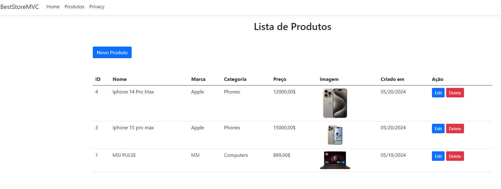

CRUD ASP.NET CORE MVC SQL SERVER COM ENTITY FRAMEWORK

Nesse projeto estarei fazendo uma CRUD para uma lista de Produtos onde teremos uma página de Lista de Produtos, Formulário de inclusão de novos produtos, Update de Produto e Delete de Produtos.

O Banco de dados utilizado será o SQL Server e o FrameWork será o Entity Framework.
A versão do CORE será a NET 8.

O Código fonte está comentado para melhor entendimento de tudo o que foi feito para o resultado final.
